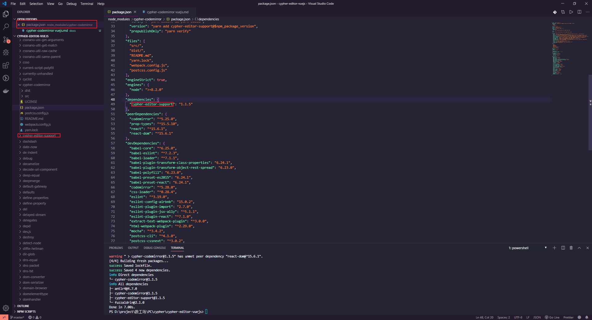
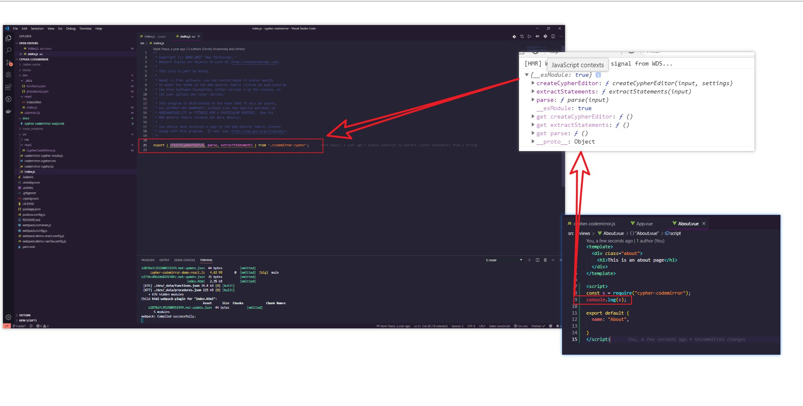
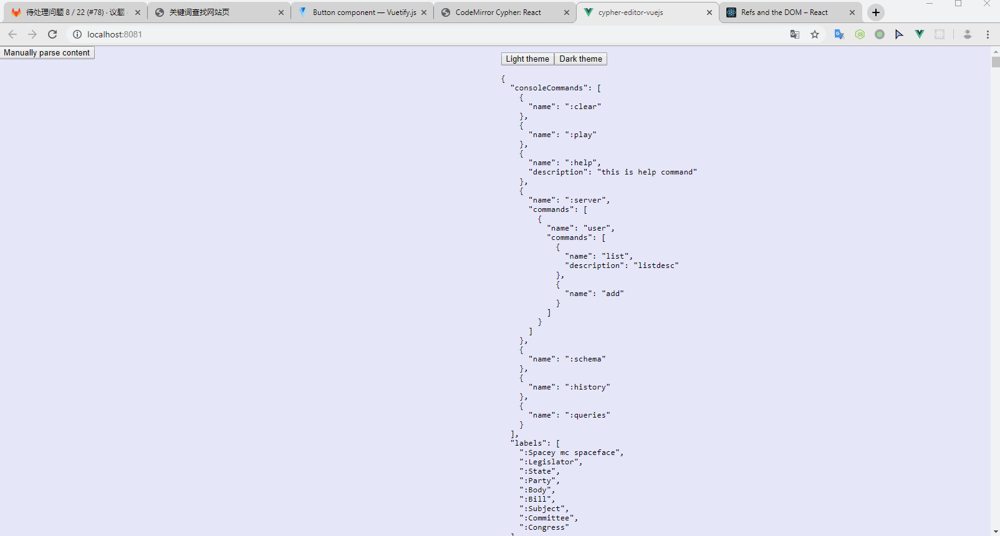

#  cypher-codemirror vuejs

## cypher-codemirror 包引用了 cypher-editor-support



## cypher-codemirror 包里暴露出来的三个方法



## 无法引入 css 文件的解决方案

```bash
yarn add postcss-import postcss-cssnext --dev
```

## 引入 codemirror 的 css 文件

```js
import "codemirror/lib/codemirror.css";
import "codemirror/addon/lint/lint";
import "codemirror/addon/lint/lint.css";
import "codemirror/addon/hint/show-hint";
import "codemirror/addon/edit/closebrackets";
import "cypher-codemirror/dist/cypher-codemirror-all.css";
import CypherCodeMirror from "@/components/CypherCodeMirror.vue";
import { neo4jSchema, codeMirrorSettings } from "@/assets/common";
```

## 成功展示编辑器

仅高亮，没补全

